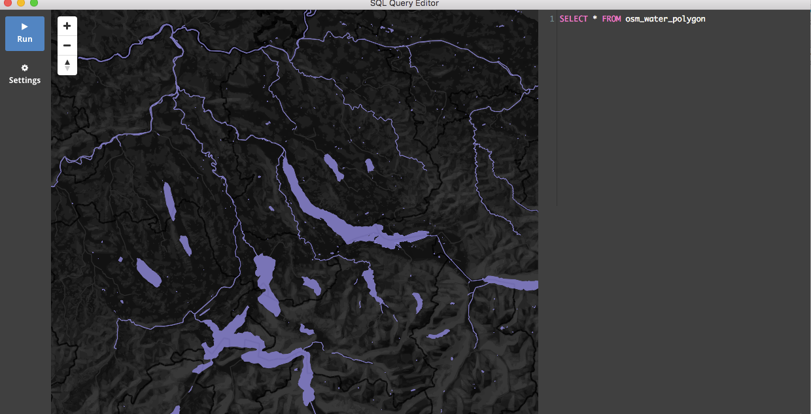

# PostGIS Query Editor

A very accessible PostGIS query editor and visualizer.
Getting started with PostGIS is harder than it should be. We spent much time in **psql** and wished to visualize
our queries quickly without big complicated tools.

It is still early days..but you can already execute and visualize a query.

## Get Started

Th
Install node dependencies.

```bash
npm install
```

Run Electron app.

```bash
npm start
```

### Screenshot


